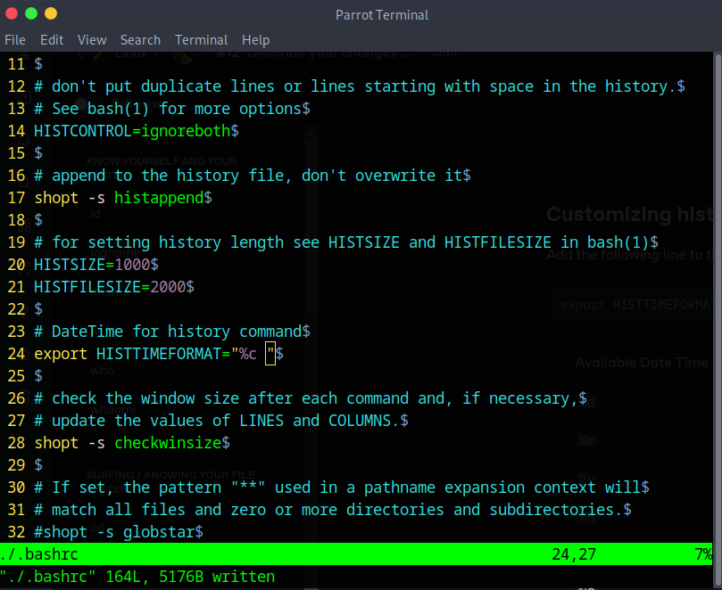

# history

## Introduction


***

## Syntax


***

## Important Flags

| Flag        | Description                                                                                                |
| ----------- | ---------------------------------------------------------------------------------------------------------- |
| `-c`        | Clear the history list by deleting all of the entries.                                                     |
| `-d offset` | Delete the history entry at position OFFSET. Negative offsets count back from the end of the history list. |
| `-a`        | Append history lines from this session to the history file.                                                |
| `-n`        | Read all history lines not already read from the history file and append them to the history list.         |
| `-r`        | Read the history file and append the contents to the history list.                                         |
| `-w`        | Write the current history to the history file.                                                             |
| `-p`        | Perform history expansion on each ARG and display the result without storing it in the history list.       |
| `-s`        | Append the ARGs to the history list as a single entry.                                                     |

***

## Disabling and Enabling history

To prevent recording commands in the history list, temporarily disable recording by using:

```bash
set +o history
```

To re-enable recording, use:

```bash
set -o history
```

The commands have no output

## Interactive Mode Commands

| Flag     | Description                                                                                                                                                         |
| -------- | ------------------------------------------------------------------------------------------------------------------------------------------------------------------- |
| `ctrl-P` | Move to the previous history entry. This is the same action as the up arrow.                                                                                        |
| `ctrl-N` | Move to the next history entry. This is the same action as the down arrow.                                                                                          |
| `alt-<`  | Move to the beginning (top) of the history list.                                                                                                                    |
| `alt->`  | Move to the end (bottom) of the history list, i.e., the current command line.                                                                                       |
| `ctrl-R` | Reverse incremental search. This searches incrementally from the current command line up the history list.                                                          |
| `alt-P`  | Reverse search, non-incremental. With this key, type in the search string and press enter before the search is performed.                                           |
| `alt-N`  | Forward search, non-incremental.                                                                                                                                    |
| `ctrl-O` | Execute the current item in the history list and advance to the next one. This is handy if you are trying to re-execute a sequence of commands in the history list. |

***

## Additional Features of history

| Flag                          | Description                                                                                                  |
| ----------------------------- | ------------------------------------------------------------------------------------------------------------ |
| `!!`                          | Repeat the last command. It is probably easier to press the up arrow and enter.                              |
| `![number]`                   | Repeat history list item number.                                                                             |
| `![number]:`                  | Displays the command associated with event number without executing it.                                      |
| `!-[number]`                  | Add a dash (-) before the command number to run a specific command from the end of the list.                 |
| `![string]`                   | Repeat last history list item starting with string.                                                          |
| `!?[string]`                  | Repeat last history list item containing string.                                                             |
| `^[old string]^[new string]^` | If you made a typo in a previous command, change it using this syntax. You can find a detailed example below |

***

## Examples

| Command                                                                                                        | Description                                                                  |
| -------------------------------------------------------------------------------------------------------------- | ---------------------------------------------------------------------------- |
| <pre class="language-bash" data-overflow="wrap"><code class="lang-bash">history
</code></pre>                  | Displays the command history.                                                |
| <pre class="language-bash" data-overflow="wrap"><code class="lang-bash">history 5
</code></pre>                | Shows the last 5 commands from the command history.                          |
| <pre class="language-bash" data-overflow="wrap"><code class="lang-bash">!1997
</code></pre>                    | Reruns the command with event number 1997.                                   |
| <pre class="language-bash" data-overflow="wrap"><code class="lang-bash">!1997:p
</code></pre>                  | Displays the command associated with event number 1997 without executing it. |
| <pre class="language-bash" data-overflow="wrap"><code class="lang-bash">!-7
</code></pre>                      | To reuse the seventh last command                                            |
| <pre class="language-bash" data-overflow="wrap"><code class="lang-bash">history | grep chpasswd
</code></pre>  | Filters and displays only the commands containing the term “chpasswd.”       |
| <pre class="language-bash" data-overflow="wrap"><code class="lang-bash">!!
</code></pre>                       | Reruns the last executed command.                                            |
| <pre class="language-bash" data-overflow="wrap"><code class="lang-bash">!command_starting_string
</code></pre> | Executes the latest command starting with “command\_starting\_string.”       |
| <pre class="language-bash" data-overflow="wrap"><code class="lang-bash">history -d 1996
</code></pre>          | Removes the command with event number 1996 from history.                     |
| <pre class="language-bash" data-overflow="wrap"><code class="lang-bash">history -c
</code></pre>               | Clears the entire command history.                                           |
| <pre class="language-bash" data-overflow="wrap"><code class="lang-bash">history | tail
</code></pre>           | Displays the last 10 commands from the history.                              |

***

### Customizing history output to show datetime stamps

Add the following line to the `.bashrc` file:

```bash
export HISTTIMEFORMAT="<DateTime_Format>"
```

| Available Date Time Formats | Description                                           |
| --------------------------- | ----------------------------------------------------- |
| `%d`                        | Day.                                                  |
| `%m`                        | Month.                                                |
| `%y`                        | Year.                                                 |
| `%H`                        | Hour.                                                 |
| `%M`                        | Minutes.                                              |
| `%S`                        | Seconds.                                              |
| `%F`                        | Full date (Y-M-D format).                             |
| `%T`                        | Time (H:M:S format).                                  |
| `%c`                        | Complete date and timestamp (Day-D-M-Y H:M:S format). |

For example, To view the complete date and timestamp for each command in history, use the following format:

```bash
export HISTTIMEFORMAT="%c "
```

<figure><figcaption></figcaption></figure>

Now save the file and run the command `source .bashrc` or open a new terminal and run the history command to see the DateTime stamps.

***

### Fixing Typos in Previous Command

If you made a typo in a previous command, use the following syntax to fix it:

```bash
^[old_string]^[new_string]^
```

<figure><figcaption></figcaption></figure>

***

## References




